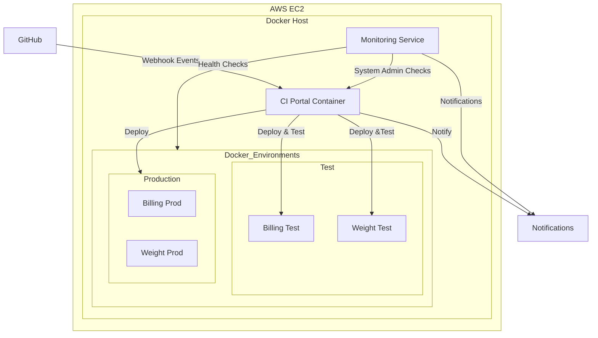

# DevOps CI Solution for Gan-Shmuel Project

## Table of Contents
- [Overview](#overview)
- [Project Description](#project-description)
- [System Architecture](#system-architecture)
- [Repository Structure](#repository-structure)
- [Implementation Phases](#implementation-phases)
- [Deployment Guide](#deployment-guide)
- [Troubleshooting](#troubleshooting)

## Overview
This document describes the CI solution for the Gan-Shmuel Project, which manages multiple applications in a monorepo structure with automated testing and deployment workflows.

## Project Description

### Teams and Components
- Three teams: Billing, Weight, and DevOps
- Each team works in dedicated feature branches
- Applications include REST APIs and MySQL databases
- Docker-based deployment for both test and production environments

### Core Functionality

### Technology Stack
| Component | Technology | Purpose |
|-----------|------------|----------|
| Core Development | Python 3.8+ | CI Portal, API Integration |
| Scripting | Bash | Automation, Monitoring |
| Database | MySQL | Application DBs |
| Containerization | Docker, Docker-Compose | Deployment, Environment Management |
| Version Control | GitHub | Source Code Management |
| API | REST | Inter-application Communication, Application logic |

### Monorepo Description 
- Billing, Weight, and DevOps applications in a single repository
- Each team has its own folder in the repository
- Each team creates a feature branch (billing-app, weight-app, devops) where the team works on their development
- Billing and Weight teams 
    - Create two docker-compose files: one for the test environment and one for the production environment.
    - Create a set of automated tests that are executed on the test environment
- The DevOps team creates a docker-compose file for the CI portal server

#### Repository struature
```
/
├── billing/
|   |── src/
│   ├── docker-compose.test.yml
│   ├── docker-compose.prod.yml
│   └── tests/
├── weight/
|   |── src/
│   ├── docker-compose.test.yml
│   ├── docker-compose.prod.yml
│   └── tests/
└── DevOps/
    ├── ci_script.sh
    ├── webhook_server.py
    ├── docker-compose.yml
    |── documentation/
    └── monitoring/

```
## Implementation Phases
### Phase 1: Core Development
- CI Portal development (Python/shell)
- GitHub webhook configuration
- Tests automation
- Basic notification system (email)
- Monitoring system development (Python/shell)
### Phase 2: CI Enhancements
- Master branch tagging for deployed-to-production versions
- Automated rollback procedure (to the last tagged version)
- Manual rollback procedure (to a specific version)
- Full integration tests (Billing and Weight apps)
- Configuration management (ports, app names, emails, etc.) using configuration json files
- Logs cleanup 
- Initial deployment automation (using GitHub manual workflow)
### Monitoring Integration
The CI system includes a comprehensive monitoring solution for both host machine and containers. For detailed information, see [Monitoring System Design](Monitoring%20Design.md).

### Independent Development
The system supports parallel development of CI and Monitoring components:
- CI System: Handles webhook processing and deployment
- Monitoring System: Provides system metrics and container status
- Both systems share the same container but operate independently
- Testing can be performed separately using dedicated endpoints


## Deployment Guide
### AWS EC2 Instance Setup
#### Prerequisites Check and Installation
```bash
# Check installed packages
which git docker docker-compose curl

# Install required packages if missing
sudo apt-get update
sudo apt-get install -y git docker.io docker-compose curl
```
#### Repository Setup
```bash
# Create working directory
mkdir -p /home/ubuntu/gan-shmuel
cd /home/ubuntu/gan-shmuel

# Clone specific branch and keep only DevOps folder
git clone -b feat/devops-monitoring --single-branch https://github.com/LaxForce/Gan-Shmuel-Project.git temp
mv temp/DevOps .
sudo rm -rf temp
cd DevOps

# Delete unnecessary files
sudo rm -r devops_documentation/ readme.txt 
```

#### Docker Configuration
```bash
# Start Docker service
sudo systemctl start docker
sudo systemctl enable docker

# Add current user to docker group
sudo usermod -aG docker $USER
newgrp docker

# Create docker networks
docker network create ci_test_network
docker network create ci_prod_network
```
#### Deploy CI and Monitoring Containers
```bash
cd /home/ubuntu/gan-shmuel/DevOps
docker-compose up -d --build

# Verify Deployment
docker ps
curl http://localhost:8080/health

# Verify monitoring endpoint
curl http://localhost:8080/monitoring
```
- Note: later this process will be automated using GitHub Action (Manual workflow)

### GitHub Configuration

#### Repository Settings

- Navigate to Settings → Webhooks
- Add webhook:
    - Webhook URL: http://<ec2-ip>:8080/github-webhook
    - Content type: application/json
    - Events: Push, Pull Request
#### Branch Protection

- Enable branch protection on master:
    - Require pull request reviews
    - Do not allow bypassing the above settings

## Troubleshooting
### Common Issues
- The CI portal server is not running
   - Verify the EC2 instance is running
   - Verify the webhoook server is running
   - Verify webhook logs
   - Confirm GitHub webhook is configured correctly

- Container Issues
   - Check containers status
   - View containers logs
   - Restart CI portal container

- CI Process Failures
   - Check CI logs
   - Check testing logs
   - Validate docker and docker-compose files

### Full Docker Re-build
In case of issues that look sporadical and not reproducible, try a full re-build:

```bash
docker-compose down
docker system prune -f
docker volume prune -f
docker-compose build --no-cache
docker-compose up
```

As well, ensure that docker networks exist and create them if not:
```bash
docker network create ci_test_network
docker network create ci_prod_network
```
### Health Checks
- Check CI portal Status
```python
  curl http://<ec2-ip>:8080/health
```
- Check applications health


