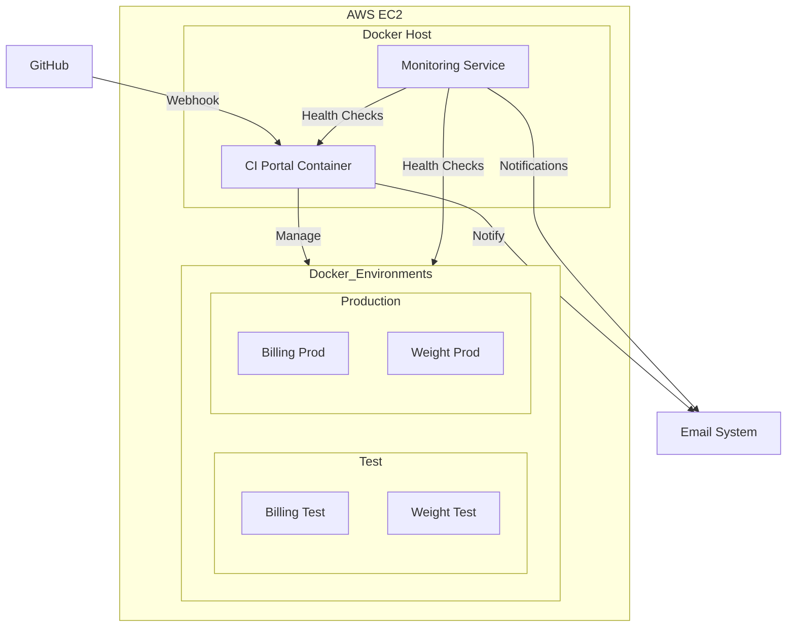
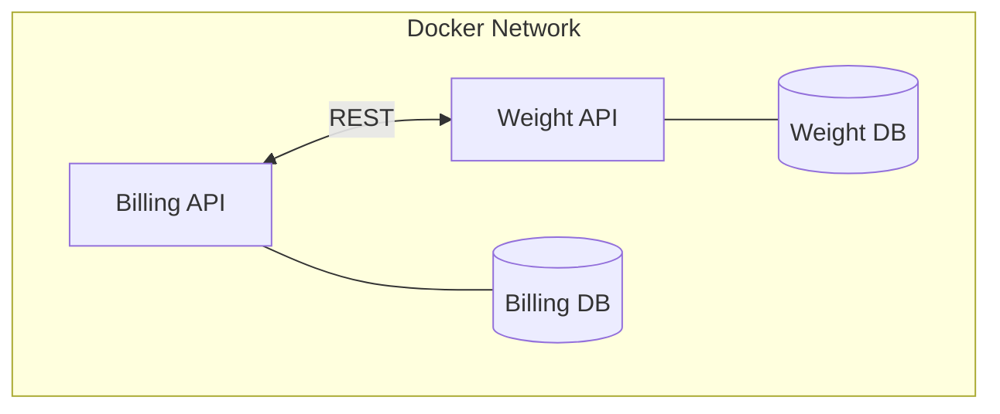
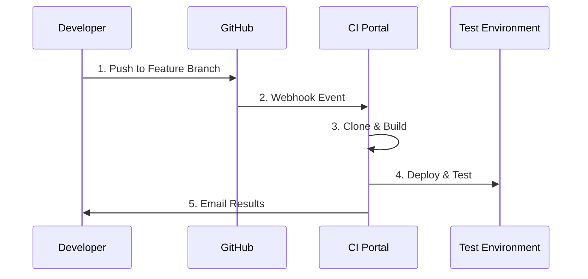
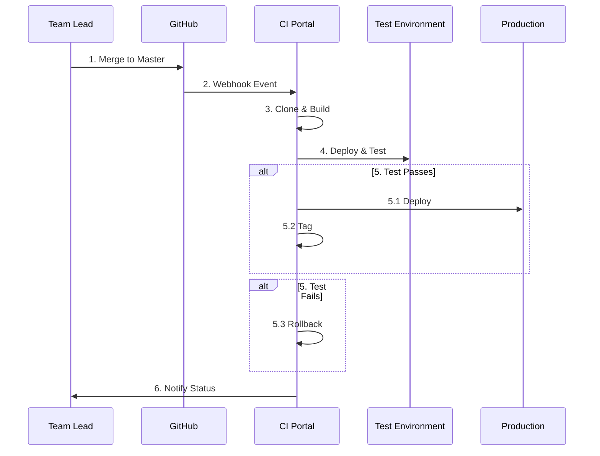

 # Green Project DevOps CI/CD Solution - High Level Design

## 1. System Architecture Overview



## 2. Technology Stack
| Component | Technology | Purpose |
|-----------|------------|----------|
| Core Development | Python 3.8+ | CI Portal, API Integration |
| Scripting | Bash | Automation, Monitoring |
| Database | MySQL | CI Portal Data, Application DBs |
| Containerization | Docker, Docker-Compose | Environment Management |
| Version Control | Git | Source Code Management |
| API | REST | Inter-application Communication |

## 3. Application Components

### 3.1 Docker Network Architecture


### 3.2 Docker Image Management
- Image tagging strategy: `<app>:<git-tag>-<env>`
- Example: `billing:v1.0.0-prod`, `weight:feature-123-test`
- Rollback procedure using tagged images
- Volume management for persistent data

## 4. DevOps Team Responsibilities

### Expert A: Repository & Webhook Management
- GitHub webhook configuration and security
- Repository operations (clone, branch management)
- Git tag management for versioning

### Expert B: CI Portal & Environment Management
- CI Portal development (Python/MySQL)
- Docker environment orchestration
- Database management for all components

### Expert C: Testing & Monitoring
- Test environment automation
- Monitoring system development
- Email notification system

## 5. Process Flows

### 5.1 Feature Branch Flow


### 5.2 Production Deployment Flow


## 6. Monitoring Solution
```python
# Simple monitoring example
def check_environments():
    environments = {
        'billing-prod': 8001,
        'weight-prod': 8002
    }
    
    for env, port in environments.items():
        try:
            response = requests.get(f'http://localhost:{port}/health')
            if response.status_code != 200:
                send_alert(f"Service {env} unhealthy")
        except:
            send_alert(f"Service {env} down")
```

## 7. API Integration Considerations
- Docker network isolation between environments
- Shared network for inter-service communication
- Volume mapping for persistent data
- Health check endpoints for monitoring
