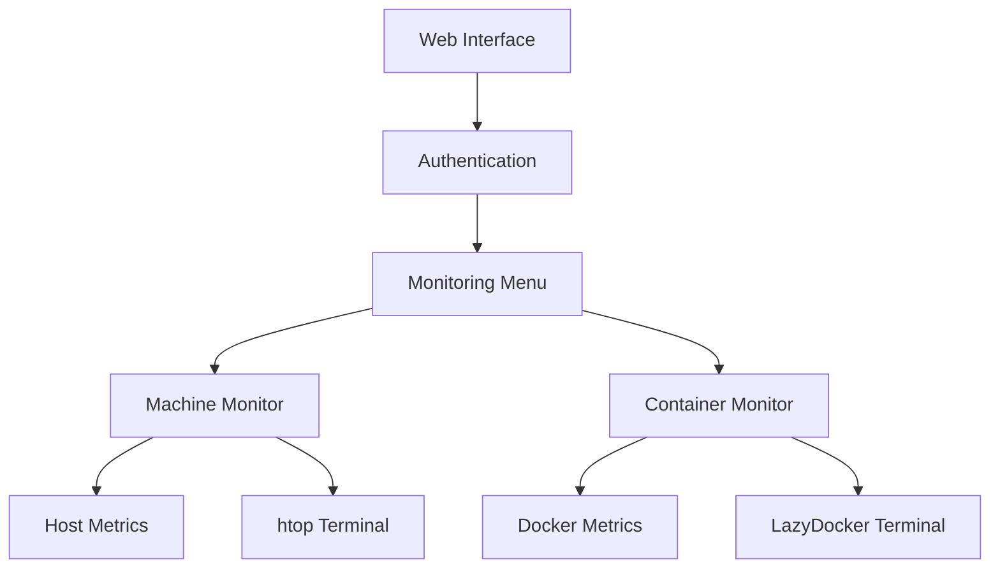
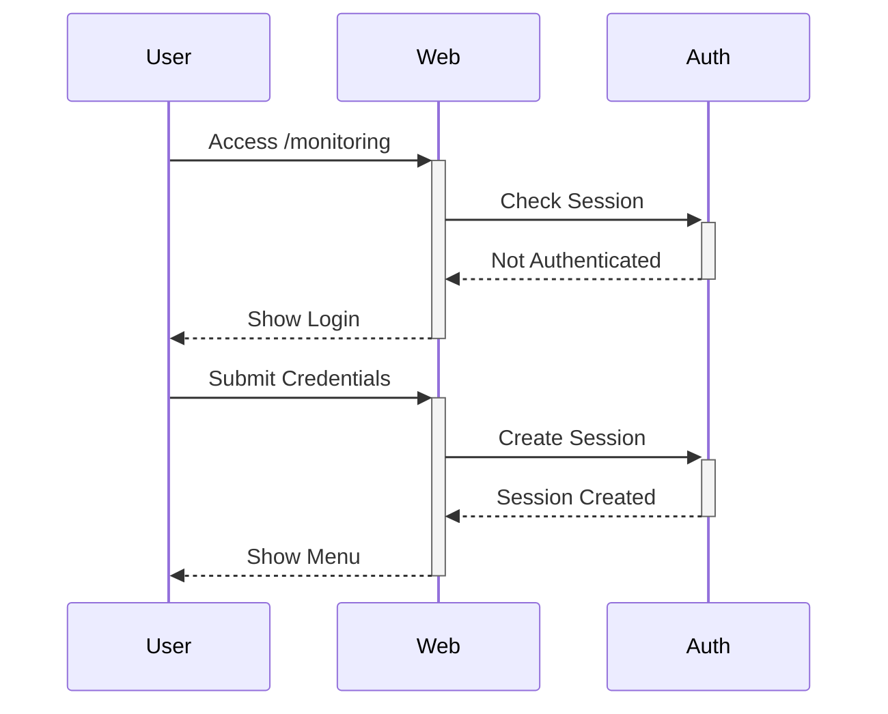

# Monitoring System Design for Gan-Shmuel Project

## Table of Contents
- [Overview](#overview)
- [System Architecture](#system-architecture)
- [Components](#components)
- [Implementation Details](#implementation-details)
- [Deployment Guide](#deployment-guide)
- [Testing Guide](#testing-guide)

## Overview
Web-based monitoring system providing real-time metrics for both host machine and Docker containers.

## System Architecture

## Components
| Component | Purpose |
|-----------|---------|
| Web Interface | User interaction and metrics display. |
| Authentication | Secure user login and access control. |
| Metrics Collection | Real-time host system and containers stats. |
| Monitoring Menu | Navigation for host and container monitoring. |
| Machine Monitor | Host metrics and htop terminal. |
| Container Monitor | Docker container metrics and LazyDocker terminal. |

## Directory Structure
```bash
monitoring/
├── __init__.py
├── routes.py
├── static/
│   └── styles.css
└── templates/
    ├── login.html
    ├── menu.html
    ├── machine.html
    └── containers.html
```
## Implementation Details
### Authentication Flow

### Metrics Collection
- Host Metrics: CPU, Memory, Disk usage via psutil
- Container Metrics: Status, Resource usage via Docker API
- Real-time updates using JavaScript fetch

## Deployment Guide
### Prerequisites (included into Dockerfile)
```bash
# System packages
apt-get install -y htop python3-pip

# Python packages
pip3 install flask psutil docker-py

# LazyDocker
curl https://raw.githubusercontent.com/jesseduffield/lazydocker/master/scripts/install_update_linux.sh | bash

```
### Docker Deployment
```bash
# Build and run
docker-compose up -d

# Verify deployment
curl http://localhost:8080/monitoring/health
```
### Configuration

- Mount host volumes for metrics access
- Configure Docker socket access
- Set up session management
## Testing Guide
### Component Testing
- 1. Authentication
```bash
curl -X POST http://localhost:8080/monitoring \
  -d "username=test&password=test"
```
- 2. Metrics Endpoints
```bash
curl http://localhost:8080/monitoring/machine/metrics
curl http://localhost:8080/monitoring/containers/list
```

### Integration Testing
- 1. Web Interface Flow
    - Access /monitoring
    - Login process
    - Menu navigation
    - Real-time metrics display
- 2. Terminal Tools
    - htop terminal launch
    - LazyDocker terminal launch

### Monitoring Health Check
```bash
# Check service status
docker ps | grep monitoring

# View logs
docker logs ci_system
```